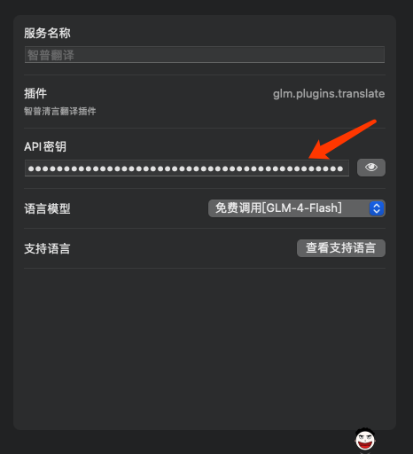
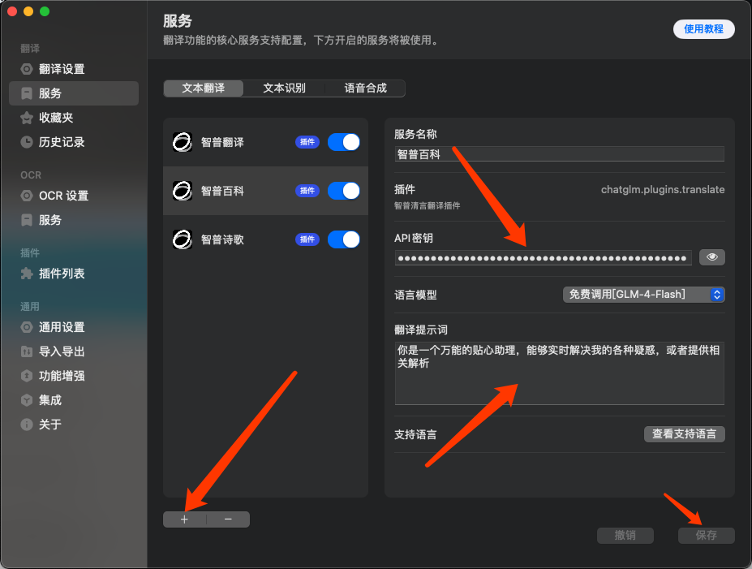
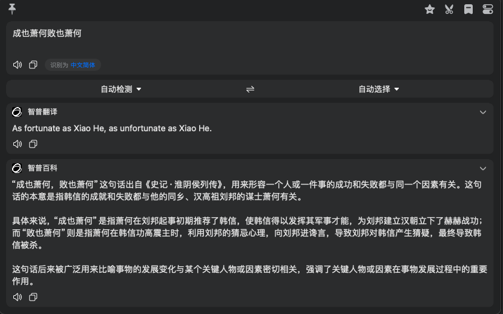
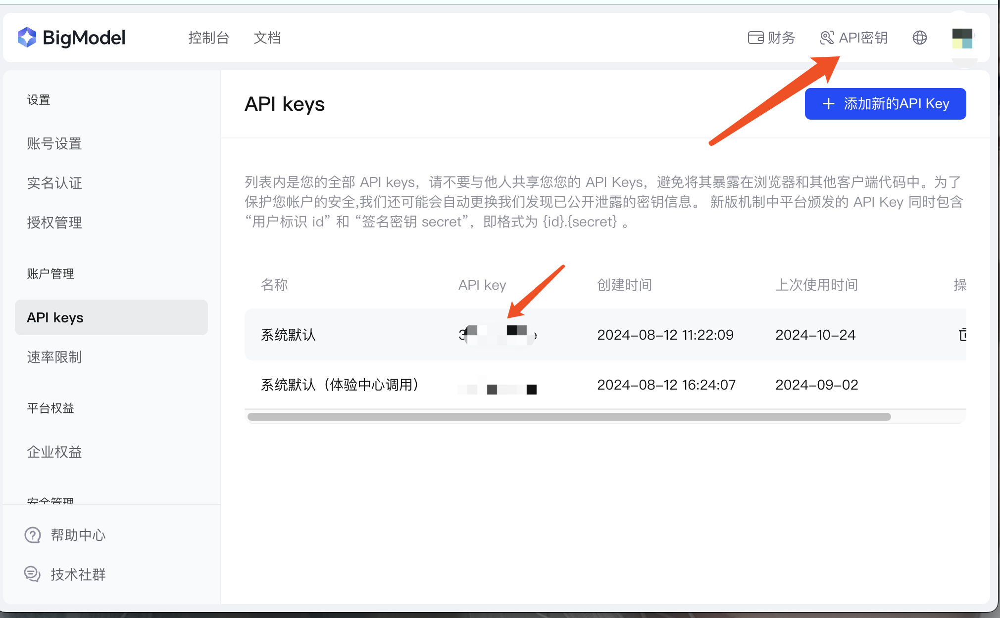

# bob-plugin-chatglm-translate
> 这是一个使用 ChatGLM 模型进行翻译的bob插件,如果你是一个MacOS用户，可以尝试使用这个插件。
> 本人目前已经自用一段时间,基本没啥问题,有建议欢迎提issues~
## 为什么开发这个插件
- 智普目前是我所知道的唯一一个免费开发API接口调用的AI公司(仅限flash版本),而且实际使用体验很不错
- 然而目前尚未发现有实际可用插件,无奈只能自己上了,虽然本人对js语法了解不多,凑合写一下吧

## 使用方法
- 下载并安装bob翻译软件(良心好用的国产软件,不贵建议购买)
- 双击安装插件
- 配置好你的智普API密钥
  

## 进阶玩法
- bob可以支持同一个插件多次添加,鉴于此通过提示词功能,配置不同的`服务名称` `提示词`,就可以发挥出远超翻译软件的功能:
  
- 然后,你可以有更多玩法,比如名词解释,文言文翻译,写点小作文等等;发挥你的聪明才智吧,效果如下:
  

## 怎么获取智普API密钥
- 首先前往[智谱AI大模型开放平台](https://open.bigmodel.cn/)完成账号注册
- 前往控制台创建密钥,并复制到插件配置中,即可
  