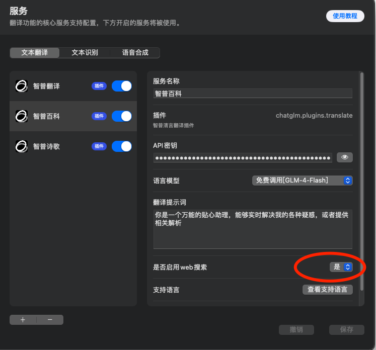
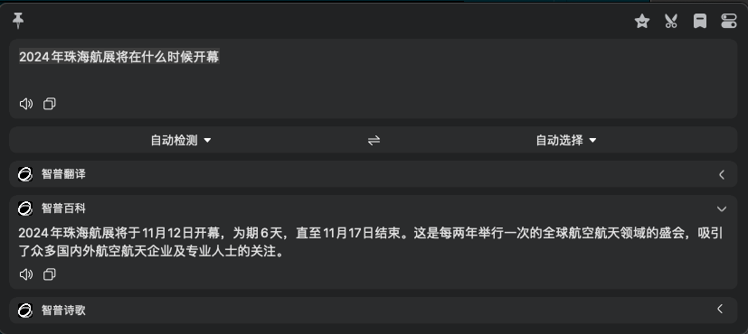

# bob-plugin-chatglm-translate
> 这是一个使用 ChatGLM 模型进行翻译的bob插件,如果你是一个MacOS用户，可以尝试使用这个插件。
> 本人目前已经自用一段时间,体验远超常规翻译,有建议欢迎提issues~
## 为什么开发这个插件
- 智普目前是我所知道的唯一一个免费开发API接口调用的AI公司(仅限flash版本),而且实际使用体验很不错
- 然而目前尚未发现有实际可用插件,无奈只能自己上了,虽然本人对js语法了解不多,凑合写一下吧

## 使用方法
- 下载并安装bob翻译软件(良心好用的国产软件,值得付费使用~)
- 双击安装插件
- 配置好你的智普API密钥
  
  

## 进阶玩法
### 多功能助理
- bob可以支持同一个插件多次添加,鉴于此通过提示词功能,配置不同的`服务名称` `提示词`,就可以发挥出远超翻译软件的功能:
  
- 然后,你可以有更多玩法,比如名词解释,文言文翻译,写点小作文等等;发挥你的聪明才智吧,效果如下:
  

### 智能搜索引擎(扔掉恼人的的常规web搜索)
- 通过开启web搜索功能,bob可以实时查询最新的互联网信息,并帮你总结搜索结果输出
  
- 效果如下:
  - 开启前:
  
  - 开启后:
  

## 怎么获取智普API密钥
- 首先前往[智谱AI大模型开放平台](https://open.bigmodel.cn/)完成账号注册
- 前往控制台创建密钥,并复制到插件配置中,即可
  

## 关于联网搜索
- 本开关默认关闭,请按需打开
- 仅用于翻译时通常建议关闭
- 开启联网搜索时,大概会额外消耗1k tokens,当然FLASH依旧免费,其他模型请自行斟酌